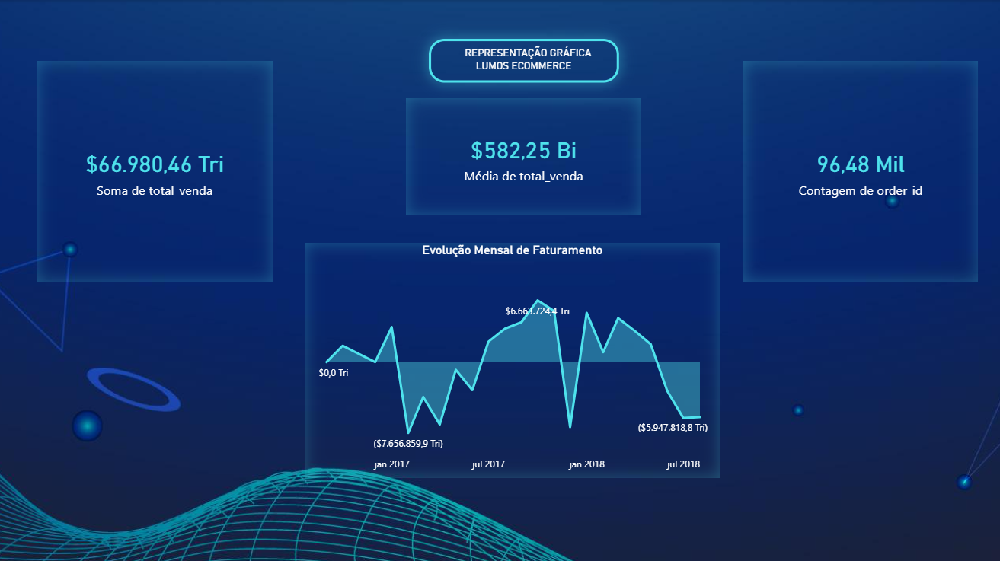

<h1 align="center"> Quantum Analytics ⚛️</h1>

## 💻 Sobre o projeto

Projeto de **Engenharia e Visualização de Dados** focado na construção de um pipeline ETL (Extract, Transform, Load) automatizado. O objetivo foi resolver o desafio de dados fragmentados de um e-commerce (Olist), unificando bases distintas para criar uma representação gráfica de alto nível para tomada de decisão estratégica.

## 🤯 O sistema realiza:

- **Extração Automatizada:** Script Python que varre e carrega dinamicamente múltiplos datasets (Pedidos, Itens, Produtos, Pagamentos);
- **Unificação de Dados:** Cruzamento inteligente de tabelas (Merges) para consolidar a jornada do pedido;
- **Tratamento de Dados:** Higienização de valores nulos, tipagem de dados temporais e categorização de produtos;
- **Engenharia de Atributos:** Criação de novas métricas (Faturamento Total, Sazonalidade) para enriquecer a análise;
- **Visualização High-End:** Dashboard no Power BI com design *Glassmorphism* (efeito neon), tratando escalas complexas (Trilhões) e focado em UX.

## 🧠 Tecnologias utilizadas:

O projeto integra processamento de dados robusto com visualização avançada:

    
    
     

 

    
    
    

## 📚 Conceitos aplicados

Neste projeto, a solução técnica abrangeu:
+ **Arquitetura ETL:** Do dado bruto ao insight visual;
+ **Manipulação de Dados:** Uso avançado da biblioteca Pandas para grandes volumes;
+ **Data Storytelling:** Construção de narrativa visual no Power BI;
+ **UI/UX Design:** Aplicação de transparências, contraste e hierarquia visual em dashboards;
+ **Automação:** Scripts prontos para escalar o processamento de novos arquivos.
  

---

<table>
  <tr>
    <td>
      
    </td>
    <td>
      Feito por <a href="https://github.com/codebydavidd">David Nathan.</a>🚀
    </td>
  </tr>
</table>
